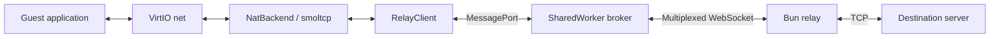

# Networking

The guest has an Ethernet device, but the browser cannot open arbitrary TCP
sockets. A user-mode network stack handles guest packets and sends TCP payloads
to a Bun relay, which opens real sockets on the guest's behalf.

Each tab runs its own machine, VirtIO device, and NAT in the emulator worker.
The SharedWorker shares the WebSocket, not guest network state or TCP flows.

## Guest interface and local services

[VirtIO net](../crates/emulate-core/src/devices/virtio_net.rs) exchanges Ethernet
frames through RX/TX queues. `Machine` moves frames between the device and its
`NetBackend` during network polling. The [hostnet implementation](../crates/emulate-core/src/hostnet/)
uses smoltcp to terminate guest TCP and implements these local services:

| Traffic | Handling |
| --- | --- |
| DHCP | Assigns `10.0.2.15/24`, gateway `10.0.2.2`, DNS `10.0.2.3` |
| ARP | Replies for the gateway and DNS server |
| ICMP echo | Replies for the gateway and DNS server; other ICMP is not forwarded |
| DNS | Resolves A queries through the relay and synthesizes guest replies; AAAA returns an empty answer |
| TCP | Bridges application bytes to relay sockets |
| Other UDP / IPv6 | Not forwarded |

The browser automatically asks `emuctl` to connect through the separate
[guest control port](emulation.md#guest-control). Disconnect brings the interface
down and clears its configuration. Shell users can also run
`emuctl net connect` and `emuctl net disconnect`.

## Following a connection end to end

For `wget http://example.com` in the guest:

1. `udhcpc` obtains the local DHCP lease; DHCP does not contact the relay.
2. The guest queries `10.0.2.3`. The NAT sends `RESOLVE example.com` through
   `RelayClient`; the relay resolves the name and returns permitted addresses.
3. The guest sends a TCP SYN to the selected address. The NAT requests a relay
   connection and waits for `OK` before completing the guest-facing handshake.
4. smoltcp reassembles guest TCP payloads. Those bytes pass through the broker's
   WebSocket channel into the relay's `Bun.connect` socket.
5. Reply bytes follow the reverse path; smoltcp constructs packets that VirtIO
   delivers back to Linux.

The WebSocket carries TCP payloads and control messages, not Ethernet packets.
HTTPS uses the same path: TLS runs between the guest application and destination.
Each guest TCP flow gets one real relay TCP socket. The destination sees the
relay's outbound IP. With `RELAY_ALLOW_PRIVATE=true` for local development,
`10.0.2.2` maps to the relay's loopback. The default policy refuses this address.

## Shared browser transport

The [browser network broker](../web/src/network/) owns one WebSocket per relay
URL across same-origin tabs. Every emulator has a MessagePort; the broker
maps local channel IDs to unique wire IDs so tabs remain isolated. A dedicated
network worker provides one WebSocket per tab if SharedWorker is unavailable.

The deployed multiplexed endpoint is `/api/relay`; the local relay uses `/`. Text commands include a channel ID, such
as `<id> CONNECT <address>:<port>` or `<id> RESOLVE <name>`. Binary frames prefix
the payload with a four-byte channel ID. Responses report connection success,
resolution results, errors, and closure.

Channels have 256 KiB credit windows. Relay `ACK` messages return credit for
bytes written to TCP; browser `WINDOW` messages return receive credit as the
emulator consumes data. Per-channel and aggregate limits bound queued traffic.
A stalled guest pauses its flow rather than allowing unbounded buffering.
The relay charges each chunk before forwarding, waiting for Redis when
configured. Pending quota and TCP-upload queues share a 1 MiB per-flow and
8 MiB process limit; a quota check that takes over 10 seconds closes the flow.

Restarting or closing a guest releases its channels. The last attached tab
releases the socket. Socket loss resets attached flows; new requests reconnect
without replaying old streams. The relay approximates TCP half-close: after a
guest `FIN`, it continues receiving until peer EOF or 30 seconds of silence.

The globe represents the current tab: gray means the shared socket is down,
yellow means the socket is connected but the guest network is inactive, and
green means both socket and guest interface are active. It does not test whether
a particular destination is reachable. The Network panel lists recent TCP
connections for that guest, not HTTP requests or other tabs' activity.

## Relay and CLI configuration

Run `just relay` to start Bun on `ws://127.0.0.1:7654`, the default for local
Vite development and the CLI. Production uses the page origin at `/api/relay`;
`VITE_RELAY_URL` can override this for standalone relay development. The CLI accepts `--relay`
or `EMULATE_RELAY_URL` with `boot --net user`. The native transport shares one
`/` WebSocket across TCP flows and DNS requests, using the same framing and
credit windows as the browser. A helper thread handles connection setup; the
emulator polls the socket without blocking. Socket loss fails existing channels,
and a new guest request starts a fresh connection. Both hosts share the Rust
`RelayClient` and NAT logic. The native transport supports `ws://`; browsers can
use `wss://` for secure deployments.

The relay validates resolved destination addresses, denying private, loopback,
and link-local ranges by default, including the guest-gateway alias.
`ipaddr.js` parses and classifies addresses, including IPv4-mapped IPv6.
`RELAY_ALLOW_PRIVATE=true` explicitly permits private destinations. Client-IP forwarding is trusted only when
`RELAY_TRUST_PROXY=true` explicitly enables it for a trusted proxy.
`RELAY_ALLOW_ORIGIN` restricts browser page origins, but does not authenticate
callers: non-browser clients can forge that header. Connection limits, byte caps, idle deadlines,
and a 1 GiB per-IP daily quota (reset at UTC midnight) bound resource use. Redis
is required on Vercel and optional for local use. Store errors refuse new flows
and forwarding rather than disabling limits.

See [relay/README.md](../relay/README.md) for protocol framing, deployment,
configuration values, and limits. See [testing.md](testing.md) for local protocol
fixtures and the separate online DNS test.

## Vercel deployment

The root Vercel project serves the frontend and relay under the same origin.
The shared worker opens `/api/relay` directly. The function requires an
exact same-origin HTTPS WebSocket upgrade and a valid client IP from Vercel's
replacement forwarding header. Both local and deployed relays expose only
the multiplexed transport.
The relay also enforces `origins: "same-origin"` internally, so origin validation
does not depend on the API wrapper alone.

Origin checks constrain browser callers; they do not authenticate arbitrary
clients, which can forge the header. Private destinations remain blocked, and
Redis enforces shared per-IP connection limits and a 1 GiB daily byte quota.
Networking fails closed when Redis is unavailable. All API responses use
`private, no-store`.

The Bun function has a 300-second maximum duration. When it ends, existing TCP
flows end too; the broker reconnects for new flows. Vercel's Bun adapter does
not invoke WebSocket `drain` or return `-1` from sends, so the relay also polls
buffered amounts to resume paused flows. Multiplexed receive credit still
limits outstanding payloads.

Before promoting a preview, verify on Vercel that same-origin upgrades succeed,
missing and foreign origins are rejected, two tabs share one socket, and
networking reconnects after the function lifetime. Check the actual response
headers for HTML, Wasm, guest files, and API responses. These platform checks
cannot be established by the local standalone relay.
